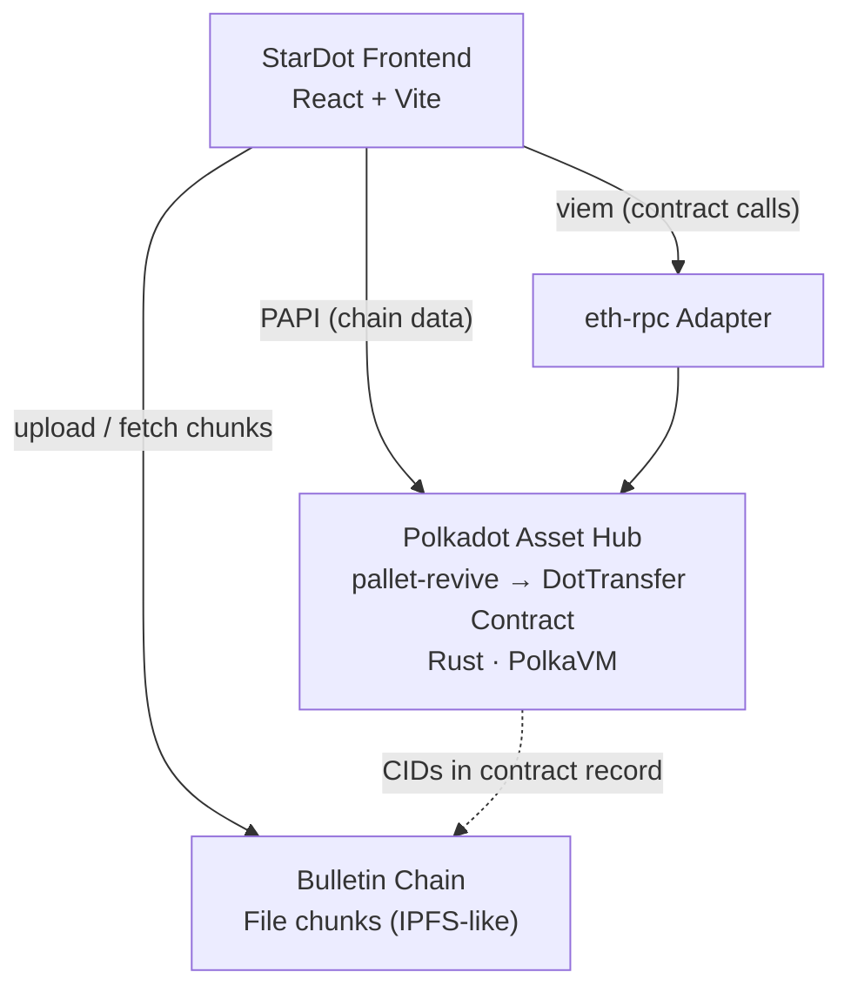
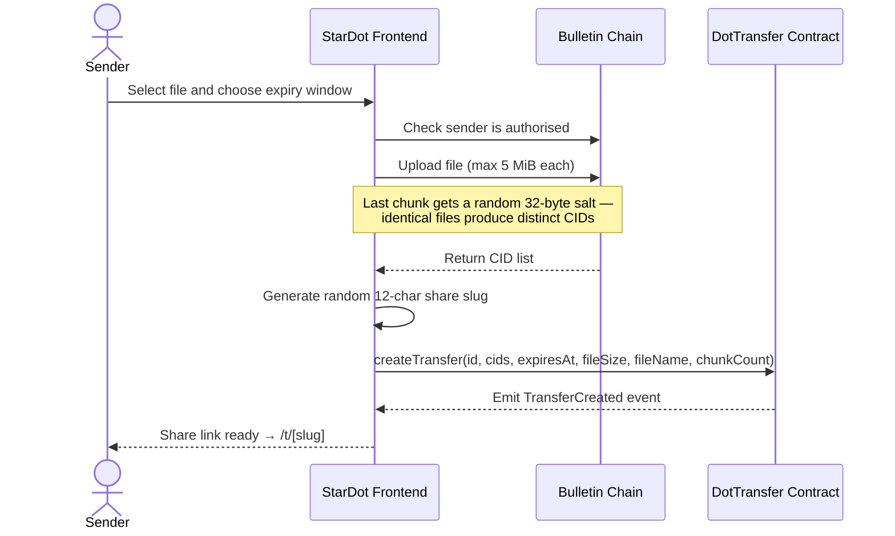
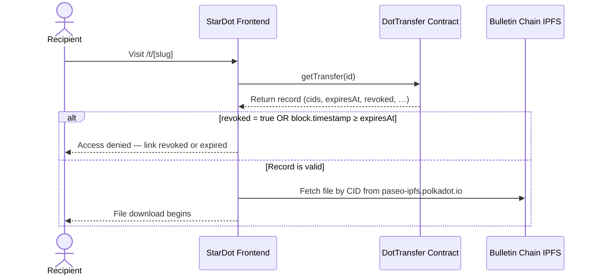

# [StarDot](https://stardot-fechame.dot.li/)

Deployed on dot.li: https://stardot-fechame.dot.li/

A decentralised, temporary file-transfer dApp built on Polkadot (Rust `via cargo-pvm-contract` + PolkaVM + Vite). Upload a file, share a link, and revoke access at any time — with no backend, no accounts, and no intermediary holding the keys.

File content is stored on the **Bulletin Chain** (Polkadot's permissioned public bulletin board / IPFS layer). The transfer record — metadata, expiry, and revocation status — lives inside a **native Rust smart contract** compiled to PolkaVM (RISC-V) bytecode and executed by `pallet-revive` on Polkadot Asset Hub.

---

## Table of Contents

1. [Tech Stack](#tech-stack)
2. [Key Features](#key-features)
3. [Architecture](#architecture)
4. [Local Setup](#local-setup)
5. [Deployment](#deployment)
6. [Testing](#testing)
7. [Limitations](#limitations)
8. [Key Versions](#key-versions)

---

## Key Features

### 1. Native Rust PVM Contract

The contract (`contracts/pvm-rust/src/dot_transfer.rs`) is written in Rust (`no_std`) using `pallet-revive-uapi` for host function calls. The `pvm-contract-macros` proc-macro derives the Ethereum-compatible ABI from a companion Solidity interface file, making the contract callable by any EVM toolchain (viem, ethers, Hardhat).

### 2. On-Demand Revocation

Calling `revokeTransfer` sets `revoked = true` in PolkaVM storage. The flag is **permanent and irreversible** — not a database toggle. No admin override, no support ticket.

### 3. Time-Bound Expiry

Every record carries an `expiresAt` Unix timestamp enforced by `block.timestamp` in the contract. Access gates expire automatically without any cron job.

### 4. Expiry Extension

The uploader can call `extendExpiry(id, newExpiresAt)` to push the deadline forward. The contract enforces that the new timestamp must be strictly later than the current one.

### 5. Enumeration-Resistant Share IDs

Transfer IDs are client-generated 32-byte random values displayed as 12-character alphanumeric slugs. The contract rejects duplicate IDs but exposes no index.

### 6. No Backend

All state — CIDs, uploader address, expiry, revocation flag — is stored on-chain in the PVM contract. The frontend is a fully static site that reads directly from the node.

---

## Tech Stack

| Layer                     | Technology                                                                |
| ------------------------- | ------------------------------------------------------------------------- |
| **Smart contract**        | Rust (`no_std`), compiled to PolkaVM (RISC-V) via `cargo-pvm-contract`    |
| **Contract ABI**          | Generated from a Solidity interface by `pvm-contract-macros` (proc-macro) |
| **Execution environment** | `pallet-revive` on Polkadot Asset Hub (Paseo TestNet / local node)        |
| **File storage**          | Bulletin Chain — Polkadot system chain used as a public IPFS gateway      |
| **Frontend**              | React + Vite, TypeScript, Tailwind CSS                                    |
| **Contract tooling**      | Hardhat 2.27, `@parity/resolc` 1.0.0                                      |

## Architecture

### Component Overview



### Upload Flow



### Download Flow



---

## Deployment

### Polkadot Hub TestNet (Paseo)

Chain ID: `420420417`

The PVM contract is deployed at:

To deploy your own instance:

```bash
# Fund the deployer address via https://faucet.polkadot.io/

# Deploy PVM (Rust) contract to Paseo
cd contracts/pvm-rust && npm ci && npm run deploy:paseo
```

The deploy script writes the new address to `deployments.json` at the repo root, which the frontend reads at build time via `web/src/config/deployments.ts`.

### Bulletin Chain Authorisation

Before uploads succeed on Paseo, the signing account must be authorised on the Bulletin Chain:

1. Go to the [Bulletin Chain faucet](https://paritytech.github.io/polkadot-bulletin-chain/)
2. Open **Faucet → Authorize Account**
3. Submit the Substrate address that will sign uploads

This is a permissioned system; authorisation grants a temporary upload allowance.

## Local Setup

### Prerequisites

| Requirement               | Version      | Install                                         |
| ------------------------- | ------------ | ----------------------------------------------- |
| **Rust**                  | stable       | `curl https://sh.rustup.rs -sSf \| sh`          |
| **Node.js**               | 22.x LTS     | [nvm](https://github.com/nvm-sh/nvm): `nvm use` |
| **Polkadot SDK binaries** | stable2512-3 | `./scripts/download-sdk-binaries.sh`            |

The binaries script fetches `polkadot-omni-node`, `eth-rpc`, `chain-spec-builder`, `zombienet`, `polkadot`, `polkadot-prepare-worker`, and `polkadot-execute-worker` into `./bin/` (gitignored). Start scripts run this automatically unless `STACK_DOWNLOAD_SDK_BINARIES=0` is set.

### Prerequisites (native)

- **OpenSSL** development headers (`libssl-dev` on Ubuntu, `openssl` on macOS)
- **protoc** Protocol Buffers compiler (`protobuf-compiler` on Ubuntu, `protobuf` on macOS)
- **Rust** (stable, installed via [rustup](https://rustup.rs/))
- **Node.js** 22.x LTS (`22.5+` recommended) and npm v10.9.0+
- **Polkadot SDK binaries** (stable2512-3): `polkadot`, `polkadot-prepare-worker`, `polkadot-execute-worker` (relay), `polkadot-omni-node`, `eth-rpc`, `chain-spec-builder`, and `zombienet`. Fetch them all into `./bin/` (gitignored) with:

    ```bash
    ./scripts/download-sdk-binaries.sh
    ```

If your platform cannot use the downloader-managed binaries, see the limited-support fallback in [docs/INSTALL.md](docs/INSTALL.md#manual-binary-fallback-limited-support).

The repo includes [`.nvmrc`](.nvmrc) and `engines` fields in the JavaScript projects to keep everyone on the same Node major version.

### Run locally

### Build Components Individually

```bash
# PVM contract (Rust → PolkaVM bytecode + ABI JSON in contracts/pvm-rust/target/)
cd contracts/pvm-rust && cargo build --release

# Frontend
cd web && npm ci && npm run build
```

### Environment Variables

The frontend reads from a `.env` file in `web/`. Defaults work for local development:

```env
# Override the Substrate WebSocket endpoint
VITE_WS_URL=ws://localhost:9944

# Override the Ethereum JSON-RPC endpoint
VITE_ETH_RPC_URL=http://localhost:8545

# Override the canonical app base URL (used when building share links)
VITE_APP_URL=https://your-domain.dot.li
```

---

## Testing

```bash
# PVM contract unit tests (Solidity variant, Hardhat)
cd contracts/pvm && npx hardhat test

# PVM Rust contract — deploy to a live local node first, then run manually
cd contracts/pvm-rust && cargo build --release && npm run deploy:local
# No offline test harness exists yet for the Rust PVM path

# Frontend type check
cd web && npx tsc --noEmit

# Frontend lint
cd web && npm run lint
```

---

## Limitations

| Area                                  | Detail                                                                                                                                                                                                                                      |
| ------------------------------------- | ------------------------------------------------------------------------------------------------------------------------------------------------------------------------------------------------------------------------------------------- |
| **N+1 trie reads**                    | `getTransfersByUploaderPage` returns IDs; the frontend then calls `getTransfer` per ID — ~180 Substrate trie traversals per page at `PAGE_SIZE=20`. Resolution: emit `TransferCreated` events and move batch reads to an off-chain indexer. |
| **Events declared, not emitted**      | `DotTransfer.sol` declares `TransferCreated/Revoked/ExpiryExtended` for ABI completeness. The Rust contract does not yet call `api::deposit_event`, which `pallet-revive-uapi` exposes and the riscv64 backend implements.                  |
| **Expiry at the gate, not the store** | Expiry hides CIDs at the contract level; chunks persist on the Bulletin Chain indefinitely. Anyone who recorded CIDs before expiry can still fetch them from IPFS directly.                                                                 |
| **No offline contract test harness**  | No `pallet-revive` equivalent of `TestExternalities` exists yet. The Rust contract must be tested against a live local node after deployment.                                                                                               |

---

## Key Versions

| Component          | Version                                 |
| ------------------ | --------------------------------------- |
| polkadot-sdk       | stable2512-3 (umbrella crate v2512.3.3) |
| polkadot           | v1.21.3 (relay chain binary)            |
| polkadot-omni-node | v1.21.3 (from stable2512-3 release)     |
| eth-rpc            | v0.12.0 (Ethereum JSON-RPC adapter)     |
| chain-spec-builder | v16.0.0                                 |
| zombienet          | v1.3.133                                |
| pallet-revive      | v0.12.2 (EVM + PVM smart contracts)     |
| Node.js            | 22.x LTS                                |
| Solidity           | v0.8.28                                 |
| resolc             | v1.0.0                                  |
| PAPI               | v1.23.3                                 |
| React              | v18.3                                   |
| viem               | v2.x                                    |
| alloy              | v1.8                                    |
| Hardhat            | v2.27+                                  |

## Resources

- [Polkadot Smart Contract Docs](https://docs.polkadot.com/smart-contracts/overview/)
- [Polkadot SDK Documentation](https://paritytech.github.io/polkadot-sdk/master/)
- [pallet-revive Docs](https://docs.rs/pallet-revive/latest/pallet_revive/)
- [PolkaVM / cargo-pvm-contract](https://github.com/paritytech/polkavm)
- [PAPI Documentation](https://papi.how/)
- [Polkadot Faucet](https://faucet.polkadot.io/) (TestNet tokens)
- [Blockscout Explorer](https://blockscout-testnet.polkadot.io/) (Polkadot TestNet)
- [Bulletin Chain Authorization](https://paritytech.github.io/polkadot-bulletin-chain/) - On Bulletin Paseo, use `Faucet` -> `Authorize Account` to request a temporary upload allowance for the Substrate account that will sign the upload.

## License

[MIT](LICENSE)
